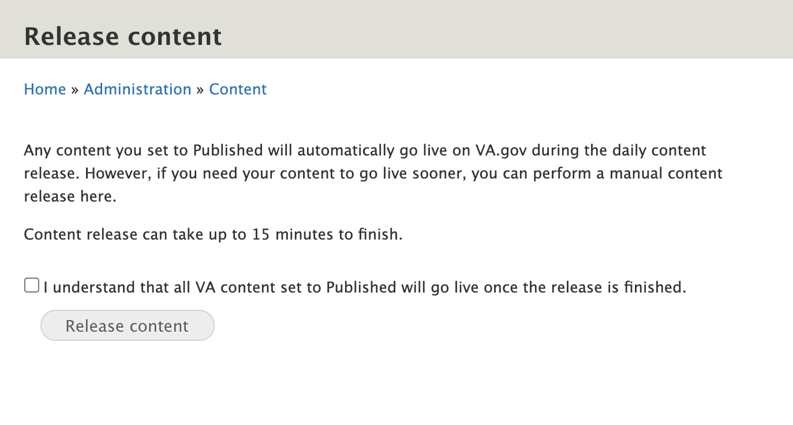
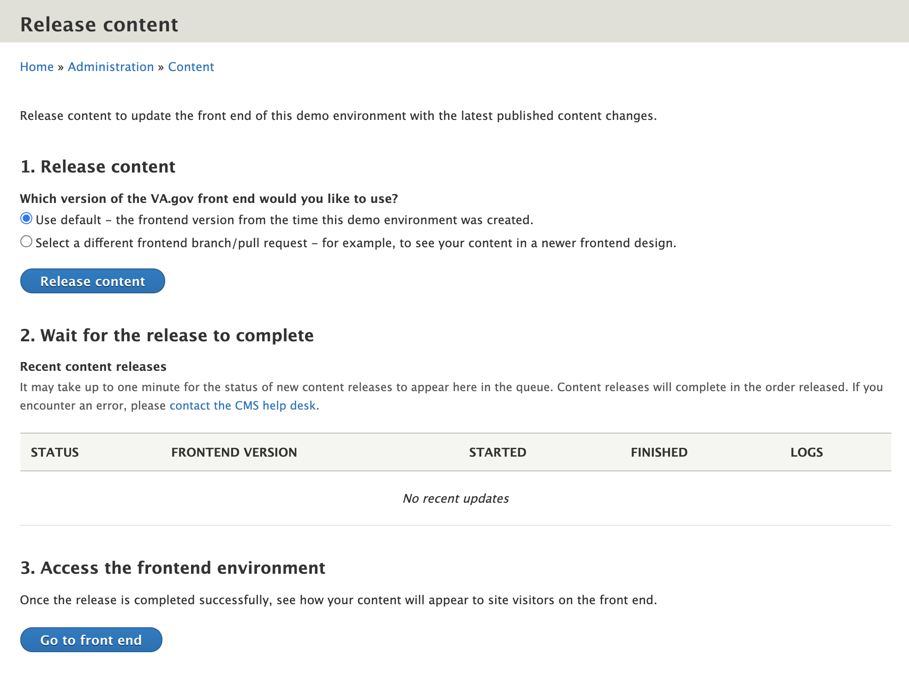

# CMS Content Release

Content releases are initiated in one of two ways:
- automatically, via [this Jenkins job](http://jenkins.vfs.va.gov/job/deploys/job/vets-website-content-autodeploy/)
- manually, via the ["Release content"](https://prod.cms.va.gov/admin/content/deploy) page in the CMS.

## Automatic

The [Content-Only Autodeploy job](http://jenkins.vfs.va.gov/job/deploys/job/vets-website-content-autodeploy/) handles automatic content deploys.

It is currently [set](https://github.com/department-of-veterans-affairs/devops/blob/676833d3d85abad9071e1df71a9c73b9f027bd41/ansible/deployment/config/jenkins-vetsgov/seed_job.groovy#L310) to execute weekdays at 9AM, 10AM, 11AM, 12PM, 1:45PM, 4PM, amd 5PM.

## Manual

Manual content releases are initiated from the **Release content** page in the CMS.

This page is constructed by the `va_gov_build_trigger` module.  The page will differ slightly in presentation and significantly in the details of its operation depending on which environment hosts it.

### Build-Release-Deploy (Production and Staging)

The Release content page on BRD environments invokes the [same Jenkins job](http://jenkins.vfs.va.gov/job/deploys/job/vets-website-content-autodeploy/) as the automatic deploys do, and consequently there should be no discrepancy between the output of the two.

### Tugboat and Local Development

The Tugboat and local development (Lando, etc) versions of the Release content page do not trigger a Jenkins job.  Instead, they check out the latest version (or a specified branch or release) of the [frontend](https://github.com/department-of-veterans-affairs/vets-website/), build it, and then perform a content release.

For more information on creating or releasing content from a preview environment, see [Environments](./environments.md).

[Table of Contents](../README.md)
